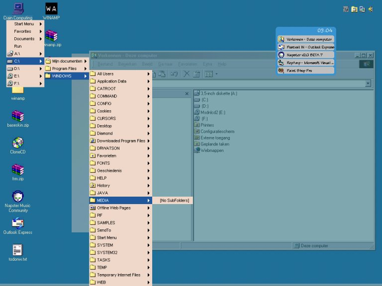



## RepShell v 0\.3\.3 UPDATE

### Description

Here's an minor update of RepShell, v 0.3.3 (EXE also included in the Zip)

The changes in this update are these:

- Fixed the ChooseColor Bug

- Fixed the StartMenu Foldout

- Added option to change quickicons

There has changed a lot since the last time it was up.

Features: 	- Fully enabled taskbox with cool buttons

- Fully functional systemtray

- Right-click my computer icon to show menu

- Automatic drive recognition and listing

- direct access to all folders

- Context menus for desktop items

- Arrow navigation on desktop and in menus

- Choose your own colors for menus

- Very fast file searching

- ability to make RepShell default shell from the option form

- Option form to change a lot of settings

- Working desktop refreshing

- File size seriously reduced

- Added item to context menu of desktopitems to rename them, this is not a standard windows function

- Simple DUN functions

- Started adding multimedia functions but decided it would be better to make that a new project

I will be posting this one soon

Even if you don't like the program there's a lot you can learn from here.

It's up to you guys to fully test it. Please leave comments.

If you're an experienced programmer take a look at questions.txt for some

issues i'm having trouble with. Maybe you can help me out.

Salihman

w/ special thanks to Stan the Man and Zorix
 
### More Info
 

             |
---                |---
**Submitted On**   |2001-01-05 03:13:30
**By**             |[Salihman](https://github.com/Planet-Source-Code/PSCIndex/blob/master/ByAuthor/salihman.md)
**Level**          |Intermediate
**User Rating**    |5.0 (40 globes from 8 users)
**Compatibility**  |VB 6\.0
**Category**       |[Complete Applications](https://github.com/Planet-Source-Code/PSCIndex/blob/master/ByCategory/complete-applications__1-27.md)
**World**          |[Visual Basic](https://github.com/Planet-Source-Code/PSCIndex/blob/master/ByWorld/visual-basic.md)
**Archive File**   |[CODE\_UPLOAD137741142001\.zip](https://github.com/Planet-Source-Code/salihman-repshell-v-0-3-3-update__1-14418/archive/master.zip)

